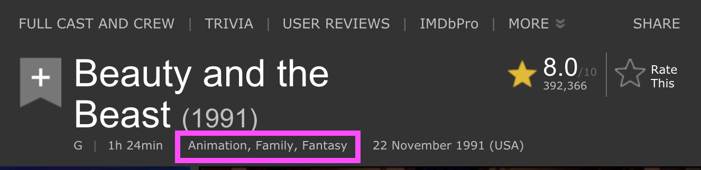

## Movie, TV Show and Musical Examples

Here are some links to lists of movies, TV shows and musicals in case you're having trouble thinking of something to add! 

### I have also [added Issues for individual movies and series](https://github.com/brittanyrw/emojiscreen/issues) that I would like to make sure are added to EmojiScreen. Feel free to grab on of those as well. 

### Movies
* [IMDB Top 100 drama list](https://www.imdb.com/search/title/?genres=drama&groups=top_250&sort=user_rating,desc)
* [IMDB Top 100 thriller list](https://www.imdb.com/search/title/?genres=thriller&groups=top_250&sort=user_rating,desc)
* [IMDB Top 100 horror list](https://www.imdb.com/search/title/?genres=horror&groups=top_250&sort=user_rating,desc)
* [IMDB Top 100 animated list](https://www.imdb.com/list/ls075496365/)

### TV
* [IMDB Top TV Shows](https://www.imdb.com/chart/toptv/)
* [Most Popular on Rotten Tomatoes](https://www.rottentomatoes.com/browse/tv-list-2/)
* [ING Top 100 TV Shows](https://www.ign.com/lists/top-100-tv-shows)

### Musicals
* [IMDB 100 Greatest Musicals](https://www.imdb.com/list/ls000071646/)
* [Greatest Musicals Ever Performed](https://www.ranker.com/crowdranked-list/best-musicals)
* [100 Top Musicals of All Time](https://www.whatsonstage.com/london-theatre/news/wos100-the-top-100-musicals-of-all-time_34333.html)

### Card Overview 🃏

On the website, each `Emoji Card` displays images of the emojis, a hint icon that will show the type (musical, movie or TV show) when the user hovers and the name of the show, which appears when the user clicks on a card.


In the code, each `Emoji Card` consists of the following JSON:

```
{
  "title": "Beauty and the Beast",
  "emojiImgs": "🏰🥀🎶📚🕰️",
  "genres": ["animation", "family", "fantasy"],
  "type": "movie",
  "year": 1991
}
```

To add a new card to the website, add a new JSON object in the `data.json` file. Make sure to separate your new object from existing objects with a comma. Below is an overview of each key in the `Emoji Card` object. Every key is required.

### Title 👍

Each card must have a title. This should be the full title.

```
{
  "title": "Beauty and the Beast",
}
```

### Emojis 😍

The emojis should be added to `emojiImgs` as a string.

## **Add five emojis maximum for each card**

```
{
  "emojiImgs": "🏰🥀🎶📚🕰️",
}
```

Using JavaScript, the emojis are converted into [Twemoji (Twitter's emoji version)](https://github.com/twitter/twemoji) so that all emojis will be uniform across platforms. And because they are pretty cute. 💖

Here are a few resources to find emojis to copy:

- [Twitter Emojis](https://www.piliapp.com/twitter-symbols/) - Shows you what each Twitter emoji looks like. Note when you copy these emojis and paste them into your text editor or Github, they will no longer look like the Twitter emojis. But don't worry, Javascript will convert them to the Twitter emojis on the EmojiScreen website.
- [Get Emoji](https://getemoji.com/) and [EmojiCopy](https://www.emojicopy.com/) are tools to copy regular emojis easily from one page. Note: The initial homepage does not display all skin color versions of each emoji so you will need to search in Emojipedia for those.
- [Emojipedia](https://emojipedia.org/) - A directory of all emojis.

### Genres 🔍

The genres should be added as an array (the square [] brackets indicates an array or list). Seperate each genre with a comma and each genre should be wrapped in quotes. There is no limit to the number of genres but try not to add too many.

```
{
  "genres": ["animation", "family", "fantasy"]
}
```

For movies and TV shows, go to the IMDB profile and find the genres listed under the title. Add these genres to the `Emoji Card` object. Some cards will only have one genre, that is okay! If you would like to add an additional genre (outside of the IMDB genres, note that in your Pull Request or [create an Issue](https://github.com/brittanyrw/emojiscreen/issues)).

See the below screenshot for the location of the genre listing in IMDB profiles.




For musicals, include the `musical` genre and any other genres from the list below that you think fit:

|         |           |           |           |        |         |             |       |
| ------- | --------- | --------- | --------- | ------ | ------- | ----------- | ----- |
| action  | adventure | animation | biography | comedy | crime   | documentary | drama |
| family  | fantasy   | film-noir | history   | horror | music   | mystery     | news  |
| romance | sci-fi    | sport     | thriller  | war    | western |             |       |
|         |           |           |           |        |         |             |       |

### Type 🎬

Specify if the card you are adding is `tv`, `movie` or `musical`. Only add one type per card.

```
{
  "type": "movie",
}
```

### Year 📆

Specify the year the movie or show was released or first aired. Or the first performance year for a musical. This should be a number (no quotations around the year).

```
{
  "year": 1994
}
```
