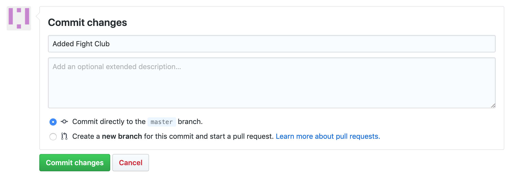
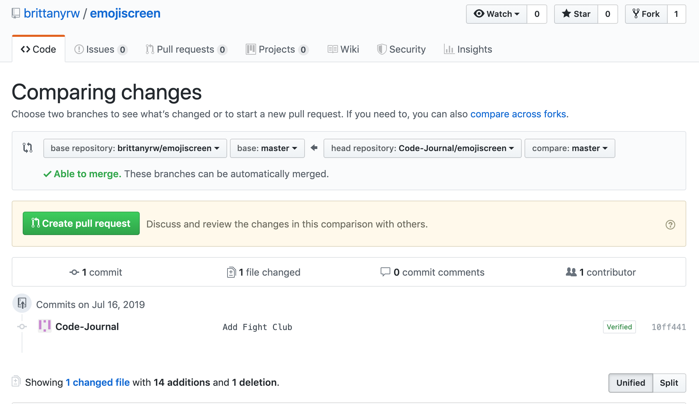

# EmojiScreen 📺 
[Visit emojiscreen.com](https://emojiscreen.com)


[EmojiScreen](https://emojiscreen.com) is a listing of movies, TV shows and musicals depicted through emojis.


## This project was built to create a fun, judgement free space for those learning Git and Github to practice making pull requests, branches, adding features, and more. 💛 💙 💜 💚 💖


## Contributing 🎁

Below are instructions for how to contribute to this project. The easiest way to make a contribution is to add a `Emoji Card` to the website. Each card should be added in the `data.json` file as an object. For more advanced ways to contribute, see the repo Issues.

Read below for a detailed overview and walkthrough on how to add an `Emoji Card` to this project. First time pull-requests are encouraged. If you run into trouble, feel free to create an Issue!

## Movie, TV Show and Musical Examples

Here are some links to lists of movies, TV shows and musicals in case you're having trouble thinking of something to add!

### Movies
* [IMDB Top 100 drama list](https://www.imdb.com/search/title/?genres=drama&groups=top_250&sort=user_rating,desc)
* [IMDB Top 100 thriller list](https://www.imdb.com/search/title/?genres=thriller&groups=top_250&sort=user_rating,desc)
* [IMDB Top 100 horror list](https://www.imdb.com/search/title/?genres=horror&groups=top_250&sort=user_rating,desc)
* [IMDB Top 100 animated list](https://www.imdb.com/list/ls075496365/)

### TV
* [IMDB Top TV Shows](https://www.imdb.com/chart/toptv/)
* [Most Popular on Rotten Tomatoes](https://www.rottentomatoes.com/browse/tv-list-2/)
* [ING Top 100 TV Shows](https://www.ign.com/lists/top-100-tv-shows)

### Musicals
* [IMDB 100 Greatest Musicals](https://www.imdb.com/list/ls000071646/)
* [Greatest Musicals Ever Performed](https://www.ranker.com/crowdranked-list/best-musicals)
* [100 Top Musicals of All Time](https://www.whatsonstage.com/london-theatre/news/wos100-the-top-100-musicals-of-all-time_34333.html)

### Card Overview 🃏

On the website, each `Emoji Card` displays images of the emojis, a hint icon that will show the type (musical, movie or TV show) when the user hovers and the name of the show, which appears when the user clicks on a card.


In the code, each `Emoji Card` consists of the following JSON:

```
{
  "title": "Beauty and the Beast",
  "emojiImgs": "🏰🥀🎶📚🕰️",
  "genres": [
    "animation",
    "family",
    "fantasy"
  ],
  "type": "movie",
  "year": 1991
}
```

To add a new card to the website, add a new JSON object in the `data.json` file. Make sure to separate your new object from existing objects with a comma. Below is an overview of each key in the `Emoji Card` object. Every key is required.

### Title 👍

Each card must have a title. This should be the full title.

```
{
  "title": "Beauty and the Beast",
}
```

### Emojis 😍

The emojis should be added to `emojiImgs` as a string.

## **Add five emojis maximum for each card**

```
{
  "emojiImgs": "🏰🥀🎶📚🕰️",
}
```

Using JavaScript, the emojis are converted into [Twemoji (Twitter's emoji version)](https://github.com/twitter/twemoji) so that all emojis will be uniform across platforms. And because they are pretty cute. 💖

Here are a few resources to find emojis to copy:

- [Twitter Emojis](https://www.piliapp.com/twitter-symbols/) - Shows you what each Twitter emoji looks like. Note when you copy these emojis and paste them into your text editor or Github, they will no longer look like the Twitter emojis. But don't worry, Javascript will convert them to the Twitter emojis on the EmojiScreen website.
- [Get Emoji](https://getemoji.com/) and [EmojiCopy](https://www.emojicopy.com/) are tools to copy regular emojis easily from one page. Note: The initial homepage does not display all skin color versions of each emoji so you will need to search in Emojipedia for those.
- [Emojipedia](https://emojipedia.org/) - A directory of all emojis.

### Genres 🔍

For movies and TV shows, go to the IMDB profile and find the genres listed under the title. Add these genres to the `Emoji Card` object. Some cards will only have one genre, that is okay! If you would like to add an additional genre (outside of the IMDB genres, note that in your Pull Request or [create an Issue](https://github.com/brittanyrw/emojiscreen/issues)).

See the below screenshot for the location of the genre listing in IMDB profiles.


For musicals, include the `musical` genre and up to two other genres from the list below:

|         |           |           |           |        |         |             |       |
| ------- | --------- | --------- | --------- | ------ | ------- | ----------- | ----- |
| action  | adventure | animation | biography | comedy | crime   | documentary | drama |
| family  | fantasy   | film-noir | history   | horror | music   | mystery     | news  |
| romance | sci-fi    | sport     | thriller  | war    | western |             |       |
|         |           |           |           |        |         |             |       |

### Type 🎬

Specify if the card you are adding is `tv`, `movie` or `musical`. Only add one type per card.

```
{
  "type": "movie",
}
```

### Year 📆

Specify the year the movie or show was released or first aired. This should be a number (no quotations around the year).

```
{
  "year": 1994
}
```

## Walkthrough 🚶‍

Follow these intstructions to add a card. You can add a card using the Github website user interface or on your local machine. If you do not already have one, create a Github account before proceeding.

> If you are already comfortable using Github and Git, feel free to skip the instructions below and make a pull request using whatever method you prefer!

## Github UI

1. Fork this repository. This will create a copy of the repository and create a new reposititory on your account. Note: the `Fork` button is located in the top right area of the repo.
2. Once the repo is forked, you will be taken to the forked repo. Note: In the top left, the name of the repo should now include your username.
3. Navigate to the `data.json` file in your forked repo by clicking on the file name.
4. Edit the `data.json` file by clicking on the pencil icon and add a new object for your movie, TV show or musical in alphabetical order. **Note: If the movie title starts with 'The' then use the next word for alphabetical order.** Make sure there is a comma between your object and the object above and below. Refer to the card overview above for requirements for the different object keys.

Use the following object as a template:

```
{
  "title": "Black Panther",
  "emojiImgs": "😺🌍🏴💪🏿🦸🏿",
  "genres": [
    "action",
    "adventure",
    "sci-fi"
  ],
  "type": "movie",
  "year": 2018
}
```

5. Once you have completed updating the object for your show or movie, scroll to the bottom of the page and add a commit message. The commit message should be formatted like: `Added Fight Club` or `Added Casablanca`. Click the `Commit Changes` button to save your changes.



6. Navigate to the `Pull Request` tab. Click on New `Pull Request`.



7. Review your changes and then click `Create Pull Request`. Add any additional comments and then click on `Create Pull Request`.
8. Wait for feedback/review of your Pull Request. If your Pull Request is accepted, you will be able to see your card at [https://emojiscreen.com](https://emojiscreen.com)!

## Local Development

### Required Downloads & Tools

- Terminal (Mac OS) or Command Prompt. These are installed by default on your computer. Search for the program to open it. **For Windows, [Git Bash](https://gitforwindows.org/) is recommended.**
- [Git](https://git-scm.com/downloads) - This is a version control tool.
- A text editor such as [Sublime Text](https://www.sublimetext.com/), [Atom](https://atom.io/), [Visual Studio Code](https://code.visualstudio.com/download), etc.
- [Python](https://www.python.org/downloads/) (optional). This will be used to run a web server on your local machine. To check if your computer already has Python installed, type `python --version` in your terminal. If you have Python, the terminal will print out the version number.

### Local Development Instructions

1. Fork this repository. This will create a copy of the repository and create a new reposititory on your account.
2. Once the repo is forked, you will be taken to the forked repo.
3. Download the project to your computer. Click on the `Clone or Download` button. Copy the HTTPS github repo link.
4. In your terminal, navigate to where you would like to save the project (such as `cd Desktop`). Run the following command, replacing the following link with your copied link: `git clone https://github.com/your-username-will-be-here/emojiscreen.git`;
5. In the terminal, navigate into the folder `cd emojiscreen`.
6. OPTIONAL: If you would like to view the project locally, open the `index.html` file in your browser. To access `data.json`, you must run a web server. First, [download Python](https://www.python.org/downloads/) if you do not have it already. Then open a new terminal window, navigate to your project folder (you should be inside of the `emojiscreen` folder when running this command) and run the following [command](https://docs.python.org/2/library/simplehttpserver.html): `python -m SimpleHTTPServer 8000`. Navigate to localhost:8000 in your browser to see the project locally.
7. Open the `emojiscreen` project in your text editor of choice. Edit the `data.json` file and add a new object for your movie, TV show or musical alphabetical order. **Note: If the movie title starts with 'The' then use the next word for alphabetical order.**. Make sure there is a comma between your object and the object above and below. Refer to the card overview above for requirements for the different object keys.

Use the following object as a template:

```
{
  "title": "The Lion King",
  "emojiImgs": "🦁👑🌍",
  "genres": [
    "animation",
    "adventure",
    "drama"
  ],
  "type": "movie",
  "year": 1994
}
```

8. Make sure to save your files after you have made changes. Once you are done, go to the terminal and type `git status`. you should see `data.json` as modified.
9. Run `git add -A` to add your changes.
10. Add a commit message. Run the following command and replace with your movie or show name: `git commit -m "Added Harry Potter the movie"`.
11. You may see a message asking for you to set your email and username. If you do not see that message (meaning you have run Git before on your machine), continue to the next step. Run the following commands, replacing "you@example.com" with your Github email and "Your name" with your github username:

`git config --global user.email "you@example.com"`

`git config --global user.name "Your Name"`

Then re-run the commit command. Remember to replace with your show or movie: `git commit -m "Added Harry Potter the movie"`

12. Run `git push`. If you have not done this before, git push will not run until you login to your Github account. Type in your Github username and password. **NOTE: When you type your password, it will not show in the terminal. Press enter after you type your password to continue**.

13. Go to the Github website and navigate to the `Pull Request` tab. Click on New `Pull Request`.


14. Review your changes and then click `Create Pull Request`. Add any additional comments and then click on `Create Pull Request`.
15. Wait for feedback/review of your Pull Request. If your Pull Request is accepted, you will be able to see your card at [https://emojiscreen.com](https://emojiscreen.com)!

## Other Resources and Options
* [Git Handbook](https://guides.github.com/introduction/git-handbook/)
* [Additional Git/Github Practice](https://try.github.io/)
* [Visualizing Git Commands Tool](https://git-school.github.io/visualizing-git/)
* Try creating a [new branch](https://github.com/Kunena/Kunena-Forum/wiki/Create-a-new-branch-with-git-and-manage-branches) for your pull request.

## Credits

Emoji graphics are by Twitter and are licensed under CC-BY 4.0. Review the [Attribution Requirements](https://github.com/twitter/twemoji#attribution-requirements) for more information.

> Please note that this project is released with a Contributor Code of Conduct. By participating in this project you agree to abide by its terms.
