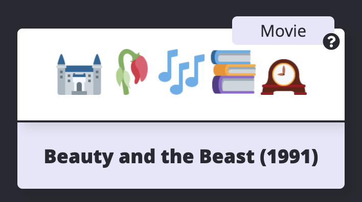

# EmojiScreen 📺


[EmojiScreen](https://emojiscreen.com) is a listing of movies, TV shows and musicals depicted through emojis. 

This project is used to teach Git and Github. Feel free to make a pull request to add one of your favorite shows or movies!

## Contributing

Below are instructions for how to contribute to this project. The easiest way to make a contribution is to add a `Emoji Card` to the website. Each card should be added in the `data.json` file as an object. For more advanced ways to contribute, see the repo Issues. 

Read below for a detailed overview and walkthrough on how to add an `Emoji Card` to this project. First time pull-requests are encouraged.

### Card Overview

On the website, each `Emoji Card` displays images of the emojis, a hint icon that will show the type (musical, movie or TV show) when the user hovers and the name of the show, which appears when the user clicks on a card. 



In the code, each `Emoji Card` consists of the following JSON:

``` 
{
    "title": "The Lion King",
    "emojiImgs": [
        "nature/lion.png",
        "animated/crown.gif",
        "nature/cat.png"
    ],
    "genres": [
        "animation",
        "adventure",
        "drama"
    ],
    "type": "movie",
    "year": 1994
  }
```

To add a new card to the website, add a new JSON object in the `data.json` file. Make sure to separate your new object from existing objects with a comma.

### Title

### Emoji Images

Click here to view a webpage listing all of the possible emojis that you can choose from and their correct filepaths. 


  <!-- "emojiImgs": [
      "nature/lion.png",
      "animated/crown.gif",
      "nature/globe-showing-europe-africa.png"
    ],
    "genres": [
      "animation",
      "adventure",
      "drama"
    ], -->

### Genres

For movies and TV shows, go to the IMDB profile and find the genres listed. Add these genres to the `Emoji Card` object. See the below screenshot for the genre listing in IMDB profiles.


For musicals, include the `musical` genre and up to two other genres from the list below: 

Action
Adult
Adventure 
Animation
Biography
Comedy
Crime
Documentary
Drama
Family
Fantasy
Film Noir
Game-Show
History
Horror
Musical
Music
Mystery
News
Reality-TV
Romance
Sci-Fi
Short
Sport
Talk-Show
Thriller
War
Western

### Type

### Year

    "type": [
      "movie"
    ],
    "year": 1994

### Walkthrough

Follow these intstructions to add a card. You can add a card using the Github website user interface or by cloning this repository to your local machine. If you do not already have one, create a Github account before proceeding.

#### Github UI
1. Fork this repository. This will create a copy of the repository and create a new reposititory on your account.
2. Once the repo is forked, you will be taken to the forked repo. 
3. Navigate to the `data.json` file in your forked repo.
4. Edit the `data.json` file and create a new object for your movie, TV show or musical. Refer to the card overview above for requirements for the object. Use the following object as a template:

``` 
{
    "title": "The Lion King",
    "emojiImgs": [
        "nature/lion.png",
        "animated/crown.gif",
        "nature/cat.png"
    ],
    "genres": [
        "animation",
        "adventure",
        "drama"
    ],
    "type": "movie",
    "year": 1994
  }
```

5. Once you have completed updating the object for your show or movie, scroll to the bottom of the page and add a commit message. The commit message should be formatted like: `Added Fight Club` or `Added Casablanca`. Click the `Commit Changes` button to save your changes.
6. Navigate to the `Pull Request` tab. Click on New `Pull Request`.
7. Review your changes and then click `Create Pull Request`. Add any additional comments and then click on `Create Pull Request`.
8. Wait for feedback/review of your Pull Request. If your Pull Request is accepted, you will be able to see your card at [https://emojiscreen.com](https://emojiscreen.com)!

#### Local Development

##### Required Downloads & Tools
* Terminal (Mac OS) or Command Prompt. For Windows, Git Bash is recommended.
* Git 
* A text editor such as Sublime Text, Atom, Visual Studio Code, etc.
* Python (optional)

##### Local Development Instructions

1. Fork this repository. This will create a copy of the repository and create a new reposititory on your account.
2. Once the repo is forked, you will be taken to the forked repo. 
3. Download the project to your computer. Click on the `Clone or Download` button. Copy the HTTPS github repo link.
4. In your terminal, navigate to where you would like to save the project (such as `cd Desktop`). Run the following command, replacing the following link with your copied link: `git clone https://github.com/your-username-will-be-here/emojiscreen.git`;
5. In the terminal, navigate into the folder `cd emojiscreen`. 
6. OPTIONAL: If you would like to view the project locally, open the `index.html` file in your browser.  To view the emoji images locally, you must run a web server. First, [download Python](https://www.python.org/downloads/). Then open a new terminal window, navigate to your project folder (you should be inside of the `emojiscreen` folder when running this command) and run the following [command](https://docs.python.org/2/library/simplehttpserver.html): `python -m SimpleHTTPServer 8000`. Navigate to localhost:8000 in your browser to see the project locally.
7. Open the `emojiscreen` project in your text editor of choice. Edit the `data.json` file and create a new object for your movie, TV show or musical. Refer to the card overview above for requirements for the object. Use the following object as a template:

``` 
{
    "title": "The Lion King",
    "emojiImgs": [
        "nature/lion.png",
        "animated/crown.gif",
        "nature/cat.png"
    ],
    "genres": [
        "animation",
        "adventure",
        "drama"
    ],
    "type": "movie",
    "year": 1994
  }
```
8. Make sure to save your files after you have made changes. Once you are done, go to the terminal and type `git status`. This 
9. 

