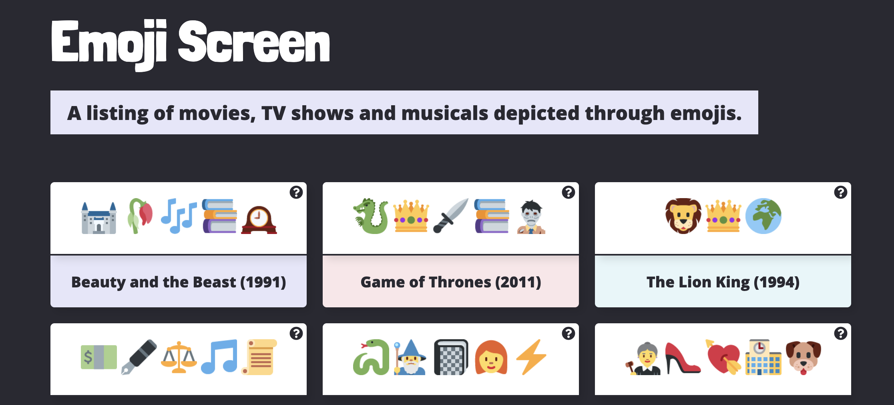

# EmojiScreen 📺 

## A listing of movies, TV shows and musicals depicted through emojis.
[Visit emojiscreen.com](https://emojiscreen.com)

## Contributing 🎁

Below are instructions for how to contribute to this project. Read through the contribution guidelines before opening a Pull Request on this project. 

## Important Note
Due to high activity, to manage the amount of contributions to this project, we are now only accepting Pull Requests that are closing Issues for adding/updating features.

Therefore, if you would like to add to this project, please follow these steps:

* [Find an Issue](https://github.com/brittanyrw/emojiscreen/issues) that you would like to complete. 
* If someone is already assigned an Issue, please move on to another Issue. If the Issue has not been assigned, comment inside of the Issue stating that you would like to work on that item. 
* Wait for confirmation from the maintainers before working on the Issue. 
* After you receive confirmation, complete the Issue and submit a Pull Request.

### We will add Issues for features to this project but there will be many times where there are no Issues available. When that happens, we ask that you move on to another project. 

Please do not submit Pull Requests unless you have been assigned an Issue to complete. Thanks! 

## Other Contribution Guidelines

Below are some additional guidelines to follow when contributing to this project. 

### Available Contributions

The current contributions that can be made to this project are the following. Click on the label links below to see what Issues are available for each type of contribution:

* Add a new feature ([view Issues here](https://github.com/brittanyrw/emojiscreen/labels/new%20feature))
* Update an existing feature, website styling, accessibility or structure ([view Issues here](https://github.com/brittanyrw/emojiscreen/issues?q=is%3Aopen+is%3Aissue+label%3Aenhancement))

If someone is assigned an Issue and doesn't complete it after a while, we will open the Issue to everyone else again.

### Adding a Movie, TV show or musical

For the time being we are only looking for new Pull Requests for features.

## Git and GitHub Resources
* [Git Handbook](https://guides.github.com/introduction/git-handbook/)
* [Additional Git/Github Practice](https://try.github.io/)
* [Visualizing Git Commands Tool](https://git-school.github.io/visualizing-git/)
* Try creating a [new branch](https://github.com/Kunena/Kunena-Forum/wiki/Create-a-new-branch-with-git-and-manage-branches) for your pull request.
* [Syncing your Fork](https://help.github.com/en/articles/syncing-a-fork)

## Credits

💖Check out a list of all [of the EmojiScreen contributors](https://github.com/brittanyrw/emojiscreen/graphs/contributors).

Emoji graphics are by Twitter and are licensed under CC-BY 4.0. Review the [Attribution Requirements](https://github.com/twitter/twemoji#attribution-requirements) for more information.

> Please note that this project is released with a [Contributor Code of Conduct](/CODE_OF_CONDUCT.md). By participating in this project you agree to abide by its terms.
