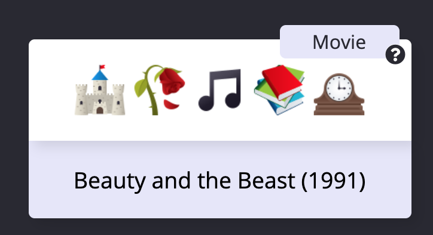
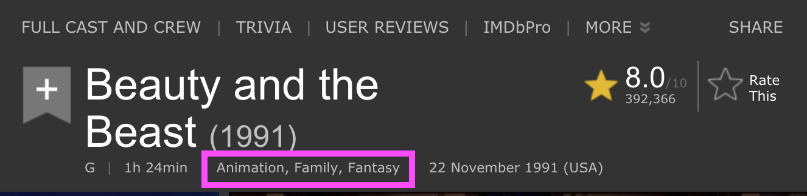

# Card Overview

Below is a detailed overview of how to add an `Emoji Card` to the project if you are completing [one of the add emoji Issues](https://github.com/brittanyrw/emojiscreen/issues?q=is%3Aopen+is%3Aissue+label%3A%22add+emojis%22). Each card should be added in the `data.js` file as an object. 

> Reminder: Please only add a card if you have been assigned an Issue to add a show or movie.

On the website, each `Emoji Card` displays 1) images of the emojis, 2) a hint icon that will show the type (musical, movie or TV show) when the user hovers and 3) the name of the show (which appears when the user clicks on a card).



In the `data.js` file, each `Emoji Card` consists of the following object:

```
{
  title: "Beauty and the Beast",
  emojiImgs: "🏰🥀🎶📚🕰️",
  genres: ["animation", "family", "fantasy"],
  itemLink: "https://www.imdb.com/title/tt0101414/",
  type: "movie",
  year: 1991
}
```

To add a new card to the website, add a new object in the `data.js` file. Make sure to separate your new object from existing objects with a comma. Below is an overview of each key in the `Emoji Card` object. Every key is required.

### Title 👍

Each card must have a title. This should be the full title.

```
{
  title: "Beauty and the Beast",
}
```

### Emojis 😍

The emojis should be added to `emojiImgs` as a string. Your emojis should be surrounded by double quotation marks.

## **Important Note: Add five emojis maximum for each card**

```
{
  emojiImgs: "🏰🥀🎶📚🕰️",
}
```

Using JavaScript, the emojis are converted into [Twemoji (Twitter's emoji version)](https://github.com/twitter/twemoji) so that all emojis will be uniform across platforms. And because they are pretty cute. 💖

Here are a few resources to find emojis to copy:

- [Twitter Emojis](https://www.piliapp.com/twitter-symbols/) - Shows you what each Twitter emoji looks like. 
- [Get Emoji](https://getemoji.com/) and [EmojiCopy](https://www.emojicopy.com/) are tools to copy regular emojis easily from one page. Note: The initial homepage does not display all skin color versions of each emoji so you will need to search in Emojipedia for those.
- [Emojipedia](https://emojipedia.org/) - A directory of all emojis.

Note when you copy these emojis and paste them into your text editor or Github, they will no longer look like the Twitter emojis. But don't worry, Javascript will convert them to the Twitter emojis on the EmojiScreen website.

### Genres 🔍

The genres should be added as an array (the square [] brackets indicates an array or list). Separate each genre with a comma and each genre should be wrapped in quotes. There is no limit to the number of genres but try not to add too many.

```
{
  genres: ["animation", "family", "fantasy"],
}
```

For movies and TV shows, go to the IMDB profile and find the genres listed under the title. Add these genres to the `Emoji Card` object. Some cards will only have one genre, that is okay! Use the genre chart below as a guide for which genres are available.

See the below screenshot for the location of the genre listing in IMDB profiles.




For musicals, include the `musical` genre and any other genres from the list below that you think fit:

|         |           |           |           |        |         |             |       |
| ------- | --------- | --------- | --------- | ------ | ------- | ----------- | ----- |
| action  | adventure | animation | biography | comedy | crime   | documentary | drama |
| family  | fantasy   | film-noir | history   | horror | music   | mystery     | news  |
| romance | sci-fi    | sport     | thriller  | war    | western |             |       |
|         |           |           |           |        |         |             |       |

### Link 🔗

Add a link to the [IMDB page](https://www.imdb.com/) if TV show or movie, or [Playbill archive page](http://www.playbill.com/vault) if it is a musical.

Make sure the link includes `https` or `http` at the beginning. The link must be wrapped in quotation marks.

For TV shows and movies, add the [IMDB page](https://www.imdb.com/) link.

For musicals link the [Playbill archive page](http://www.playbill.com/vault) for the show. Make sure the Playbill link is for the original production. It will say 'original' under the show name on Playbill. Here is an example of [the page you should be linking](http://www.playbill.com/production/les-miserables-broadway-theatre-vault-0000012257) for musicals.

```
{
  itemLink: "https://www.imdb.com/title/tt0101414/",
}
```

> Note: Make sure the IDMB link does not have `?ref_=[id number here]` at the end. If it does, delete that part of the link. This link should just be the base IMDB url.


### Type 🎬

Specify if the card you are adding is `tv`, `movie` or `musical`. Only add one type per card. 

`musical` under type is referring to live musicals performed on Broadway, the West End, local theaters etc. If you are adding a **movie** musical, please choose `movie` as the type and indicate it is a musical via genres.

```
{
  type: "movie",
}
```

### Year 📆

Specify the year the movie or show was released or first aired. Or the first performance year for a musical. This should be a  single number (no quotations around the year). Do not add ranges such as 2017-2019. 

```
{
  year: 1994
}
```

# Card Pull Request Checklist

Follow the checklist below when working on adding a card. This will help you double check that you have everything you need to have your Pull Request approved.

- [ ] 💜 There is an Issue for this show/movie and you have been assigned to add it. 
- [ ] 🌈 There is a single year under `year`. 
- [ ] 📅 There is a type from one of the following: `movie` , `tv` or `musical`.
- [ ] 🔗 There is a link to the IMDB page or Playbill archive page under `itemLink`.
- [ ] 3️⃣ There are at least three emojis listed under `emojiImgs`.
- [ ] 5️⃣ There is a maximum of five emojis listed under `emojiImgs`.
- [ ] 👍 The pull request has a descriptive title (such as `Added The Lion King` or `Added Black Panther, The Avengers: Endgame and Thor`).
- [ ] ⭐ The genres are all inside of square brackets `[ ]` and each are individually wrapped in quotation marks and have a comma between each one. (such as submitting this `"genres": ["adventure","mystery","animation"]` and not this `"genres":["adventure, mystery, animation"]`).
- [ ] 🖍️ Place the new show(s) or movie(s) in alphabetical order based on title. If the show or movie starts with 'the', then use the second word to alphabetize.
- [ ] 👋 Add Closes #--- to the bottom of the pull request to link your Pull Request to the Issue (replace the --- with the issue number)
