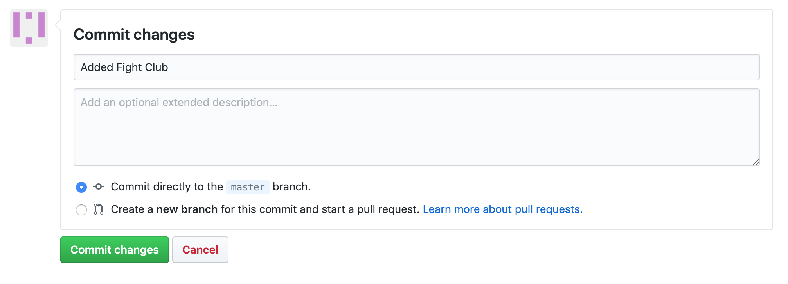

# Github Website

> This is a walkthrough of how to add an `Emoji Card` to this project.

### This method will use the Github website to contribute to this project. You will not need to download any programs to your computer using these instructions.

1. Check the [Issues](https://github.com/brittanyrw/emojiscreen/issues?q=is%3Aopen+is%3Aissue+label%3A%22add+emojis%22) to find a show or movie to add. Find an Issue that has not been assigned to someone and comment inside of that Issue asking to work on it. Make sure the Issue does not have a `needs review` label. This label means that the Issue has been added by someone that is not a maintainer and has not been approved yet. Once the Issue has been assigned to you, continue to the next step. Wait until you are assigned before continuring. If there are no open Issues, please check the project later for new Issues. Only add a card if you are assigned an Issue.
2. Fork this repository. This will create a copy of the repository and create a new repository on your account. Note: the `Fork` button is located in the top right area of the repo.
3. Once the repo is forked, you will be taken to the forked repo. Note: In the top left, the name of the repo should now include your username.
4. Navigate to the `data.js` file in your forked repo by clicking on the file name.
5. Edit the `data.js` file by clicking on the pencil icon and add a new object for your movie, TV show or musical in alphabetical order. Make sure there is a comma between your object and the object above and below. Refer to [the card overview section](/card_overview.md) for requirements for the different object keys.

Use the following object as a template:

```
{
  title: "Black Panther",
  emojiImgs: "😺🌍🏴💪🏿🦸🏿",
  genres: ["action", "adventure", "sci-fi"],
  itemLink: "https://www.imdb.com/title/tt1825683/",
  type: "movie",
  year: 2018
}
```

6. Once you have completed updating the object for your show or movie, scroll to the bottom of the page and add a commit message. The commit message should be formatted like: `Added Fight Club` or `Added Casablanca`. Click the `Commit Changes` button to save your changes.



7. Navigate to the `Pull Request` tab. Click on New `Pull Request`.


8. Review your changes and then click `Create Pull Request`. Review the [Pull Request checklist](/docs/card_overview.md#card-pull-request-checklist) to check that you have completed everything for your `Emoji Card`. Then click on `Create Pull Request`.
9. Wait for feedback/review of your Pull Request. Your code will be reviewed and if any changes need to be made, we will let you know. Once your pull request is accepted, you will be able to see your card at [https://emojiscreen.com](https://emojiscreen.com) and you will officially have contributed to the project! 🎉

