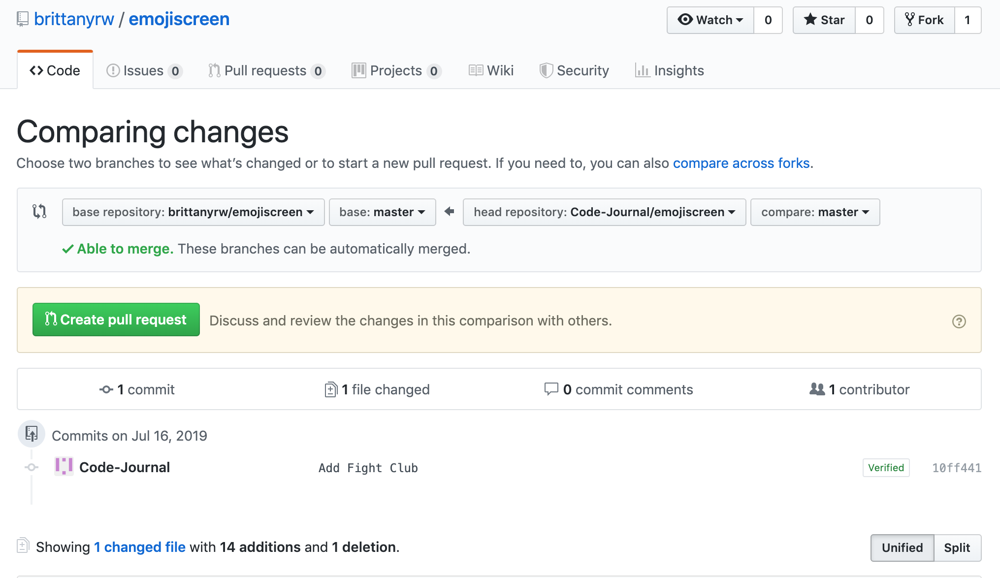

# Local Development

> This is a walkthrough of how to add an `Emoji Card` to this project.

### This method will use your local machine to contribute to the project. This will require you to download multiple programs onto your computer. This is the method most programmers use when working on projects. 

### Required Downloads & Tools

- Terminal (Mac OS) or Command Prompt. These are installed by default on your computer. Search for the program to open it. For Windows, you can also use [Git Bash](https://gitforwindows.org/).
- [Git](https://git-scm.com/downloads) - This is a version control tool. For Windows, this download will include Git Bash.
- A text editor such as [Sublime Text](https://www.sublimetext.com/), [Atom](https://atom.io/), [Visual Studio Code](https://code.visualstudio.com/download), etc.

### Local Development Instructions

1. Check the [Issues](https://github.com/brittanyrw/emojiscreen/issues?q=is%3Aopen+is%3Aissue+label%3A%22add+emojis%22) to find a show or movie to add. Find an Issue that has not been assigned to someone and comment inside of that Issue asking to work on it. Make sure the Issue does not have a `needs review` label. This label means that the Issue has been added by someone that is not a maintainer and has not been approved yet. Once the Issue has been assigned to you, continue to the next step. Wait until you are assigned before continuring. If there are no open Issues, please check the project later for new Issues. Only add a card if you are assigned an Issue.
2. Fork this repository. This will create a copy of the repository and create a new repository on your account.
3. Once the repo is forked, you will be taken to the forked repo. Note: In the top left, the name of the repo should now include your username.
4. Download the project to your computer. Click on the `Clone or Download` button. Copy the HTTPS github repo link.
5. In your terminal, navigate to where you would like to save the project (such as `cd Desktop`). Run the following command in the terminal, replacing the following link with your copied link: `git clone https://github.com/your-username-will-be-here/emojiscreen.git`;
6. After the command has been run, in the terminal, navigate into the EmojiScreen project folder: `cd emojiscreen`.
7. Open the `emojiscreen` project in your text editor of choice. Edit the `data.js` file and add a new object for your movie, TV show or musical in alphabetical order. Make sure there is a comma between your object and the objects above and below. Refer to [the card overview section](/card_overview.md) for requirements for the different object keys.  Make sure to save your file after you have made changes. 

Use the following object as a template:

```
{
  title: "The Lion King",
  emojiImgs: "🦁👑🌍",
  genres: ["animation", "adventure", "drama"],
  itemLink: "https://www.imdb.com/title/tt0110357/",
  type: "movie",
  year: 1994
}
```

8. If you would like to see what your addition will look like, open the `index.html` file that is in the `emojiscreen` folder in a web browser. The EmojiCards are added in a random order so it may take you a few seconds to find what you added. If you do not see any cards in the browser, this could mean that you have a typo in your `data.js` file. If that is the case, double check what you have added for missing commas and quotation marks.
9. Once you are done, go to the terminal and type `git status`. You should see `data.js` as modified. If you don't see this, go back and make sure to save your `data.js` file.
10. Run `git add -A` to add your changes.
11. Add a commit message. Run the following command and replace with your movie or show name: `git commit -m "Added Harry Potter the movie"`.
12. If you have never used git on your computer before, you will see a message asking for you to set your email and username. If you do not see that message, continue to the next step. Run the following commands, replacing "you@example.com" with your Github email and "Your name" with your github username:

`git config --global user.email "you@example.com"`

`git config --global user.name "Your Name"`

Then re-run the commit command. Remember to replace with your show or movie: `git commit -m "Added Harry Potter the movie"`

13. Run `git push`. If you have not done this before, git push will not run until you login to your Github account. Type in your Github username and password. **NOTE: When you type your password, it will not show in the terminal. Press enter after you type your password to continue**.

14. Go to the Github website and navigate to the `Pull Request` tab. Click on New `Pull Request`.



15. Review your changes and then click `Create Pull Request`. Review the [Pull Request checklist](/docs/card_overview.md#card-pull-request-checklist) to check that you have completed everything for your `Emoji Card`. Then click on `Create Pull Request`.
16. Wait for feedback/review of your Pull Request. Your code will be reviewed and if any changes need to be made, we will let you know. Once your pull request is accepted, you will be able to see your card at [https://emojiscreen.com](https://emojiscreen.com) and you will officially have contributed to the project! 🎉
